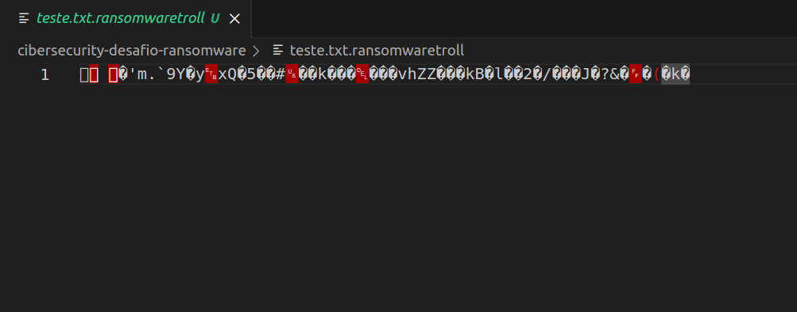
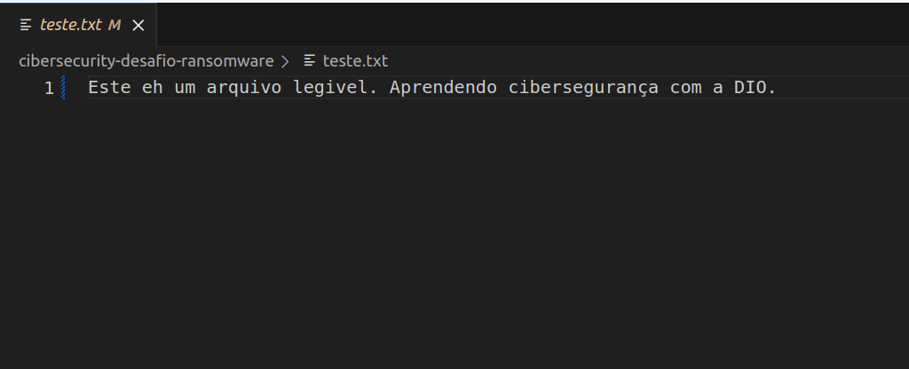

# Criptografia de um arquivo texto
Este projeto consiste em um desafio da DIO de cibersegurança, para criptografia e decriptografia de um arquivo texto. 
Este código sempre deve ser usado com responsabilidade.

## Instalação de dependências
   ```bash
   pip install -r requirements.txt
  ```
  
## Criptografia
1. Execute o script `python encrypter.py`

O código irá gerar o arquivo `teste.txt.ransomwaretroll` criptografado.



## Decriptografia
1. Execute o script `python decrypter.py`

O código irá recuperar o arquivo `teste.txt`.

